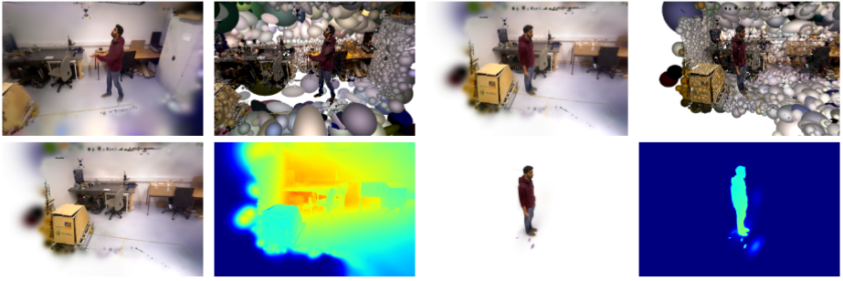

[comment]: <> (# 4D Gaussian Splatting SLAM)

<!-- PROJECT LOGO -->

  <h1 align="center"> 4D Gaussian Splatting SLAM
  </h1>
  

    

    <strong>Yanyan Li</strong> ·
    <strong>Youxu Fang</strong> ·
    <strong>Zunjie Zhu</strong> ·
    <strong>Kunyi Li</strong> ·
    <strong>Yong Ding</strong> ·
    <strong>Federico Tombari</strong>
    

  

[comment]: <> (  <h2 align="center">PAPER</h2>)
  <h3 align="center"><a href="https://arxiv.org">Paper</a> | <a href="https://youtu.be/">Video</a> | <a href="https:">Project Page</a></h3>
  

  

  

 

# 1.Installation

# 2.Testing

## Downloading Datasets

### TUM-RGBD dataset

### BONN dataset

# 3.Training  

# 4.Acknowledgement
This work incorporates many open-source codes. We extend our gratitude to the authors of the software.
- [MonoGS](https://github.com/muskie82/MonoGS)
- [3D Gaussian Splatting](https://github.com/graphdeco-inria/gaussian-splatting)
- [GeoGaussian](https://github.com/yanyan-li/GeoGaussian)
- [SIBR_viewers](https://gitlab.inria.fr/sibr/sibr_core)
- [Tiny Gaussian Splatting Viewer](https://github.com/limacv/GaussianSplattingViewer)
- [Open3D](https://github.com/isl-org/Open3D)

# 5.License

# 6.Citation

